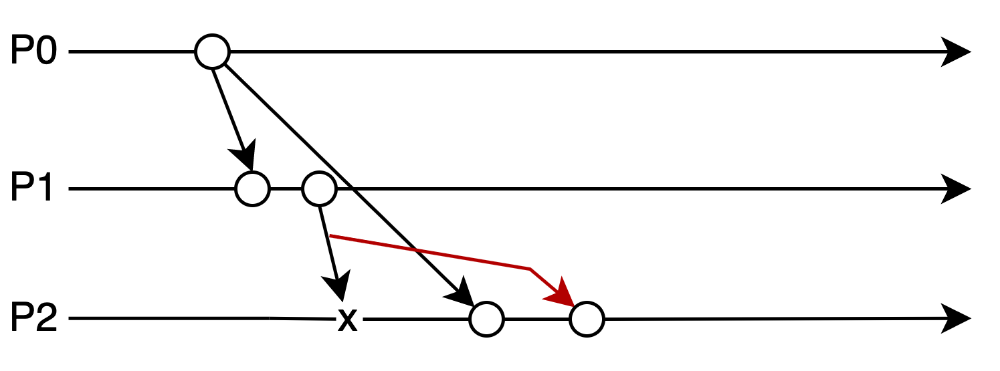

# Exercise 1: Birman Schiper Stephenson algorithm for causal ordering of messages

To run the test cases for this exercise, change `p.test_case` to 0, 1 or 2 in `main.py` to choose the test case to run.
Then run the following commands on the terminal at the root of the project:
`docker-compose build && docker-compose up`

The global variable `num_msg` gives the number of broadcasts made by each node and can be adjusted.

## Test case 0: Concurrent send events
**Number of processes**: 3

**Number of broadcasts per process**: 1

**Description**:
There is no delay between send events. As a result, all messages are sent as soon as a process is created and the messages will be concurrent.

**Expected result**: no delays should happen as all messages received by each node are concurrent.

## Test case 1: Messages with causiality relation delayed due to slow connection

*Every message is broadcasted, and every process makes the same number of broadcasts.
For clarity, only the relevant arrows for the test case are included.*

**Number of processes**: 3

**Number of broadcasts per process**: 1

**Description**:
Process P0 has a long delay (10s) between any messages it sends to process P2. All other connections have no delay.
When process P1 broadcasts after receiving a message from P0, then process P2 will receive its message from P1 before its message to P0. But because the message from P1 happened before the message from P0, P2 will delay the message from P1 until it receives the message from P0. This tests condition 2 in the algorithm.

*Expected result**: P2 will delay the message from P1 until it receives the message from P0.

## Test case 2: Message received out of order is delayed

*Every message is broadcasted, and every process makes the same number of broadcasts.
For clarity, only the relevant arrows for the test case are included.*

**Number of processes**: 3

**Number of broadcasts per process**: 2

**Description**:
Process P0 has a long delay (10s) on the first message it sends to P2 only. As a result, P2 will receive the two messages from P0 out of order: first the second message, then the first message.
The first message happened before the second message, so P2 should delay the second message until it receives the first message. This tests condition 1 in the algorithm.

**Expected result**: P2 receives the second P0 message first. P2 delays the second message from P0 until it receives the first message.
